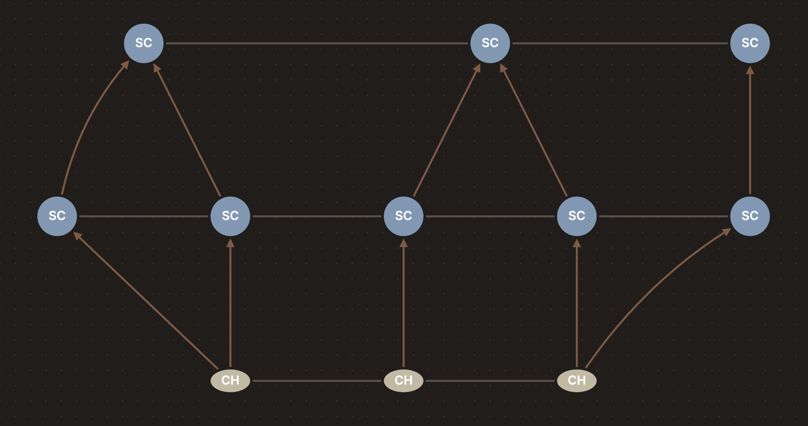
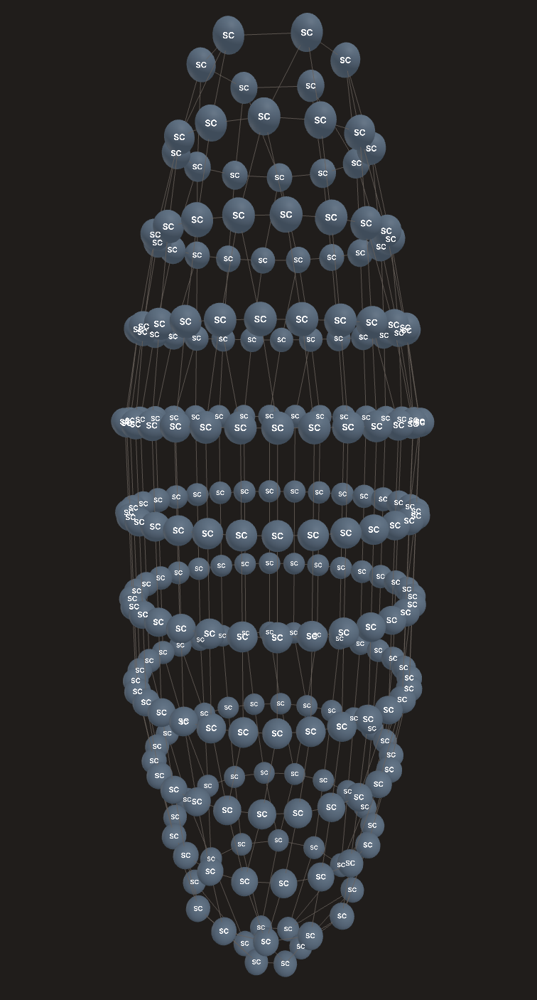
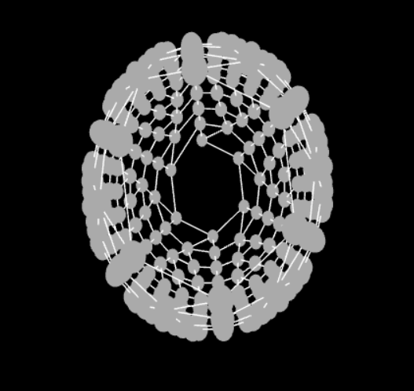

# stitch-grapher

Java-based stitch connectivity graph engine for topology-aware crochet pattern parsing and modeling.

## Overview

Stitch-grapher is a Spring Boot application that processes crochet patterns in text format and visualizes them as connectivity graphs. It models crochet stitches as a hierarchical abstraction layer, enabling complex pattern analysis and visualization.

## Project Structure

### `controller`
- Handles incoming HTTP requests.
- `GraphController.java`  
  - Exposes the `/api/graph` endpoint.  
  - Delegates work to the appropriate service (flat or circular) and returns the result as a DTO.
### `dto`
- Defines API request and response models.
- `PatternInputDto` → input from client (rows + crochet mode)
- `StitchGraphDto` → response (nodes + edges)
- `GraphNodeDto`, `GraphEdgeDto` → frontend-friendly graph format
### `exception`
- Custom exceptions used across parsing and validation.
- `ParseException` → invalid syntax during tokenization/parsing
- `ValidationException` → invalid stitch logic between rows
- `InvalidPatternException` → base exception type for pattern errors
### `graph`
- Core domain model representing the stitch graph.
- `StitchGraph` → container for all rows and nodes
- `StitchNode` → graph node (has next, previous, parents, children)
- `Row` → group of stitches with index and direction
- `RowDirection` → LEFT_TO_RIGHT / RIGHT_TO_LEFT
### `mapper`
- Transforms internal models into API responses.
- `StitchGraphMapper` → converts `StitchGraph` → `StitchGraphDto`
### `parser`
- Responsible for converting text input into structured data.
- `PatternParser` → orchestrates parsing pipeline
- `OperationType` → defines stitch behavior (input/output counts)
- `ParsedPattern`, `ParsedRow`, `ParsedOperation` → structured representation
- `CrochetMode` → FLAT / CIRCULAR
  #### `parser.tokenize`
  - Breaks raw text into tokens.
  - `PatternTokenizer`, `Token`, `TokenType`
  #### `parser.expand`
  - Expands shorthand syntax.
  - `PatternExpander` → handles repeats and numeric prefixes
### `service`
- Orchestrates the main workflow. (parse → validate → build topology)
- `PatternService` → interface
- `FlatPatternService`, `CircularPatternService` → implementations
### `stitch`
- Represents stitch types and creation logic.
- Base: `Stitch`, `AbstractStitch`
- Concrete stitches: `SingleCrochet`, `DoubleCrochet`, etc.
- `StitchType` → enum
- `StitchFactory` → creates stitch instances from operations
### `topology`
- Builds the graph structure from parsed data.
- Handles how stitches connect (including increases and decreases).
- `TopologyBuilder` → interface
- `FlatTopologyBuilder` → alternating rows + reverse parent mapping
- `CircularTopologyBuilder` → circular structure + forward mapping
### `validation`
- Ensures pattern correctness before graph construction.
- `PatternValidator` → interface
- `FlatPatternValidator` → allows unused stitches
- `CircularPatternValidator` → requires exact stitch matching

## Features

### Currently Implemented
Parse text-based crochet patterns into a structured model
- Tokenization and expansion of pattern syntax (e.g. repeats, numeric prefixes)
- Input validation for pattern correctness (flat and circular modes)
- Formal stitch topology modeling using required/produced stitch semantics (RR/RO)
- Support for increase and decrease operations (`inc`, `dec`)
- Model stitch connectivity as a graph (parent/child + next/previous relationships)
- Generate graph visualizations with row-aware positioning (2D flat + 3D circular)
- Support for multiple stitch types (SC, HDC, DC, HTR, TR, SLST)
- Directional row support for flat patterns (LEFT_TO_RIGHT / RIGHT_TO_LEFT)
- REST API endpoint for graph generation
- Comprehensive unit tests for parsing, validation, and topology building

### To Be Implemented
- Better visualization of stitch connections and hierarchy for flat and circular patterns
- Turn, chain, magic ring, fasten off operations

## A Basic Example

- **Input Pattern**:
  - `3sc`
  - `inc sc inc`
  - `2dec sc`
  - `FLAT`
- **Output**: Sample graph visualization showing stitch connections and hierarchy


- First row produces 3 stitches. Second row has 2 increase operations using row 1 stitches (1x2 + 1 + 1x2), resulting in 5 stitches. Row 3 has 2 decrease operations using row 2 stitches ((1+1)/2 + (1+1)/2 + 1), resulting in 3 stitches.
- So if you have an increase operation, you should have 2 child nodes in the next step. 
- If you have a decrease operation, you should have 2 parent nodes in the previous step.
- If you have a normal stitch, you should have 1 parent node in the previous step and 1 child node in the next step.

## More Complex Example

- **Input Pattern**:
  - `6sc`
  - `6inc`
  - `(sc, inc)x6`
  - `(2sc, inc)x6`
  - `(3sc, inc)x6`
  - `30sc`
  - `30sc`
  - `30sc`
  - `(3sc, dec)x6`
  - `(2sc, dec)x6`
  - `(sc, dec)x6`
  - `6dec`
  - `CIRCULAR`
- **Output**: Sample graph visualization showing stitch connections and hierarchy
  - Screenshot from front:<br>
  - Screenshot from the top:<br>
- Row stitches: 6 → 12 → 18 → 24 → 30 → 30 → 30 → 24 → 18 → 12 → 6
- The first row produces 6 stitches. The second row has 6 increase operations using row 1 stitches (6x2), resulting in 12 stitches. Row 3 has 6 repetitions of (sc, inc) using row 2 stitches ((1+1)x6), resulting in 18 stitches. Row 4 has 6 repetitions of (2sc, inc) using row 3 stitches ((2+1)x6), resulting in 24 stitches. Row 5 has 6 repetitions of (3sc, inc) using row 4 stitches ((3+1)x6), resulting in 30 stitches. Rows 6-8 have no operations, so they maintain the same stitch count of 30. Row 9 has 6 repetitions of (3sc, dec) using row 8 stitches ((3+1)/2x6), resulting in 24 stitches. Row 10 has 6 repetitions of (2sc, dec) using row 9 stitches ((2+1)/2x6), resulting in 18 stitches. Row 11 has 6 repetitions of (sc, dec) using row 10 stitches ((1+1)/2x6), resulting in 12 stitches. Row 12 has 6 decrease operations using row 11 stitches (12/2), resulting in the final count of 6 stitches.
- This example demonstrates a more complex pattern with multiple increase and decrease operations, showcasing the stitch connectivity and hierarchy in a circular pattern.


## Prerequisites

- Java 17+
- Maven 3.8+
- Spring Boot 3.x

## Getting Started

1. Clone the repository
2. Build the project: `mvn clean install`
3. Run the application: `mvn spring-boot:run`
4. Open your browser and navigate to `http://localhost:8080`

## API Usage

### Graph Generation Endpoint

**POST** `/api/graph`

Accepts a JSON payload with crochet pattern rows and returns a graph representation.

**Request Example:**
```json
{
  "rows": [
    "3sc"
  ], 
  "mode": "FLAT"
}
```

**Response Example:**
```json
{
  "nodes": [
    {
      "id": "5ebe4049-239a-4bba-b337-6648d3646009",
      "label": "SC",
      "row": 0,
      "position": 0,
      "direction": "LEFT_TO_RIGHT"
    },
    {
      "id": "604dbe0d-5dae-485f-bb1d-0c715395c801",
      "label": "SC",
      "row": 0,
      "position": 1,
      "direction": "LEFT_TO_RIGHT"
    },
    {
      "id": "3d04c832-a2f0-4a2b-8730-b21134b874b0",
      "label": "SC",
      "row": 0,
      "position": 2,
      "direction": "LEFT_TO_RIGHT"
    }
  ],
  "edges": [
    {
      "source": "5ebe4049-239a-4bba-b337-6648d3646009",
      "target": "604dbe0d-5dae-485f-bb1d-0c715395c801"
    },
    {
      "source": "604dbe0d-5dae-485f-bb1d-0c715395c801",
      "target": "3d04c832-a2f0-4a2b-8730-b21134b874b0"
    }
  ]
}
```

## Technologies

- **Spring Boot** - Web framework
- **Maven** - Build and dependency management
- **Java 17+** - Programming language

## License

MIT