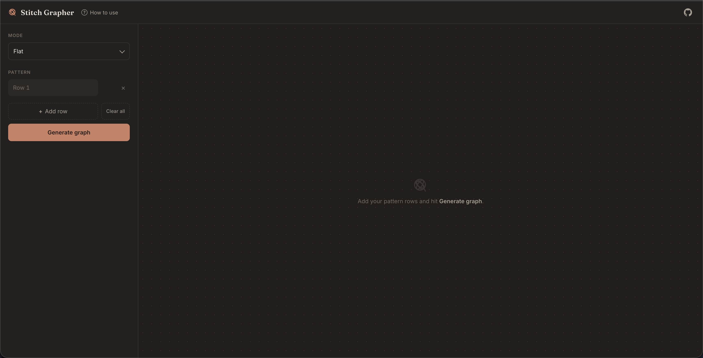

# stitch-grapher

Java-based stitch connectivity graph engine for topology-aware crochet pattern parsing and modeling.

## Overview

Stitch-grapher is a Spring Boot application that processes crochet patterns in text format and visualizes them as connectivity graphs. It models crochet stitches as a hierarchical abstraction layer, enabling complex pattern analysis and visualization.



## Features

### Currently Implemented
- Parse text-based crochet patterns into a structured format
- Support common pattern syntax
  - Repeats like `(sc, inc)x6`, numeric prefixes like `3sc`
- Validate patterns for correctness
- Support increase (`inc`), decrease (`dec`), chain (`ch`), magic ring (`mr`) operations
- Model stitch relationships as a graph 
  - How stitches connect to each other
- Visualize patterns:
  - 2D layout for flat crochet
  - 3D circular layout for amigurumi-style patterns
- Support multiple stitch types SC, HDC, DC, HTR, TR, SLST
- Handle row direction for flat patterns
- Expose a REST API to generate graphs from patterns
- Render each stitch's relative height (taller stitches like `DC`/`TR` draw as taller ellipses in 2D or ellipsoids in 3D than a baseline `SC`)
  - A stitch's height carries into the next row/round: a stitch worked into a taller stitch sits higher, so rows/rings aren't forced flat
  - The first round of a circular pattern (worked directly into the magic ring) renders cinched tightly around center, like a real magic ring, instead of at the same spacing as later rounds
- Label each stitch in the 3D view (SC, DC, etc.)

### To Be Implemented
- Further layout/visual polish for large or densely packed patterns
- Turn, fasten off operations
- FLO/BLO (front loop only, back loop only) operations

## A Basic Example

- **Input Pattern**:
  - `3ch`
  - `inc sc inc`
  - `2dec sc`
  - `FLAT`
- **Output**: Sample graph visualization showing stitch connections and hierarchy


- First row produces 3 stitches. Second row has 2 increase operations using row 1 stitches (1x2 + 1 + 1x2), resulting in 5 stitches. Row 3 has 2 decrease operations using row 2 stitches ((1+1)/2 + (1+1)/2 + 1), resulting in 3 stitches.
- So if you have an increase operation, you should have 2 child nodes in the next step. 
- If you have a decrease operation, you should have 2 parent nodes in the previous step.
- If you have a normal stitch, you should have 1 parent node in the previous step and 1 child node in the next step.

## More Complex Example

- **Input Pattern**:
    - `mr`
    - `6sc`
    - `6inc`
    - `(sc, inc)x6`
    - `(2sc, inc)x6`
    - `(3sc, inc)x6`
    - `30sc`
    - `30sc`
    - `30sc`
    - `(3sc, dec)x6`
    - `(2sc, dec)x6`
    - `(sc, dec)x6`
    - `6dec`
    - `CIRCULAR`
- **Output**: Sample graph visualization showing stitch connections and hierarchy


- Row stitches: 6 → 12 → 18 → 24 → 30 → 30 → 30 → 24 → 18 → 12 → 6

## Prerequisites

- Java 17+
- Maven 3.8+
- Spring Boot 3.x

## Getting Started

1. Clone the repository
2. Build the project: `mvn clean install`
3. Run the application: `mvn spring-boot:run`
4. Open your browser and navigate to `http://localhost:8080`

## API Usage

### Graph Generation Endpoint

**POST** `/api/graph`

Accepts a JSON payload with crochet pattern rows and returns a graph representation.

**Request Example:**
```json
{
  "rows": [
    "3ch"
  ], 
  "mode": "FLAT"
}
```

**Response Example:**
```json
{
  "nodes": [
    {
      "id": "5ebe4049-239a-4bba-b337-6648d3646009",
      "label": "CH",
      "row": 0,
      "position": 0,
      "direction": "LEFT_TO_RIGHT",
      "height": 0.6
    },
    {
      "id": "604dbe0d-5dae-485f-bb1d-0c715395c801",
      "label": "CH",
      "row": 0,
      "position": 1,
      "direction": "LEFT_TO_RIGHT",
      "height": 0.6
    },
    {
      "id": "3d04c832-a2f0-4a2b-8730-b21134b874b0",
      "label": "CH",
      "row": 0,
      "position": 2,
      "direction": "LEFT_TO_RIGHT",
      "height": 0.6
    }
  ],
  "edges": [
    {
      "source": "5ebe4049-239a-4bba-b337-6648d3646009",
      "target": "604dbe0d-5dae-485f-bb1d-0c715395c801",
      "type": "NEXT"
    },
    {
      "source": "604dbe0d-5dae-485f-bb1d-0c715395c801",
      "target": "3d04c832-a2f0-4a2b-8730-b21134b874b0",
      "type": "NEXT"
    }
  ]
}
```

**Node fields:**
- `height` - the stitch's base height, relative to a single crochet (`1.0`). Used by the UI to render taller stitches (e.g. `DC`, `TR`) as taller ellipses/ellipsoids than shorter ones (e.g. `CH`, `SLST`).

**Edge fields:**
- `type` - `"NEXT"` for the sequential stitch-working order (in circular mode, this can cross rows at a round's closing stitch), or `"PARENT"` for a true structural relationship - the stitch(es) a node was actually worked into.

## Technologies

- **Spring Boot** - Web framework
- **Maven** - Build and dependency management
- **Java 17+** - Programming language

## License

MIT